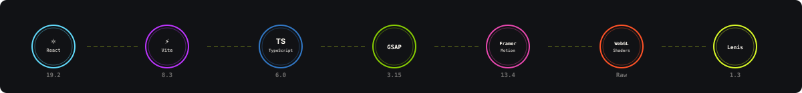

<div align="center">



<br />


<br />
<br />

**[Live demo](#live-demo)** &nbsp;·&nbsp; **[Architecture](#architecture)** &nbsp;·&nbsp; **[Motion](#motion)** &nbsp;·&nbsp; **[Design system](#design-system)** &nbsp;·&nbsp; **[Tech stack](#tech-stack)** &nbsp;·&nbsp; **[Structure](#project-structure)**

</div>

---

Samudra Kar's portfolio is a scroll-driven, cursor-aware digital world — a brand,
identity, and product designed and engineered by **Sams Studio**. It features seven
project worlds, a lab of playable experiments, an interactive About desk, and one hidden
door (Kage).

One rule held throughout: **motion must feel physically grounded and hyper-responsive.**
The desktop experience combines raw WebGL shaders, GSAP page choreographies, and Framer
Motion micro-interactions, running on a single unified render loop. Below `1000px` or
with `prefers-reduced-motion`, the site degrades gracefully into a clean, stacked layout.

## Live demo

The site runs complete with no accounts or keys required for the frontend.

```bash
git clone https://github.com/Samudra-GITHub/Sam-s_Portfolio.git
```

```bash
cd Sam-s_Portfolio && npm install && npm run dev
```

Then open <http://localhost:5173>.
The backend requires a [Resend](https://resend.com) API key for the contact form — see [Environment](#environment).

## Features

<table>
  <tr>
    <td width="50%" valign="top">
      <h3>🌊 Scroll-Driven Storytelling</h3>
      <p>The Hero is a sticky 100dvh stage inside a 280dvh section. An interactive lime dot can be grabbed and thrown; on scroll, it drops ink from wherever you left it and transitions smoothly into the Work section. Project chapters slide up over pinned ones in a cinematic handoff, each opening with a bespoke mask.</p>
    </td>
    <td width="50%" valign="top">
      <h3>🎯 Interactive Cursor & Physics</h3>
      <p>One unified lime arrow dynamically morphs across eight states: <code>default</code>, <code>link</code>, <code>project</code>, <code>play</code>, <code>drag</code>, <code>image</code>, <code>scroll</code>, and <code>cta</code>. Elements feature true spring physics and magnetic hover forces. It only runs on <code>(hover: hover)</code> devices.</p>
    </td>
  </tr>
  <tr>
    <td width="50%" valign="top">
      <h3>🔮 Seven Project Worlds</h3>
      <p>Each project is its own interactive scene: Tarang's drifting album tiles and spinning vinyl, Rinti AI's floating interface cards, AkashaLens and Ink's raw WebGL shaders, Krama's sneaker physics, Grama Sathi's community panels, and the Portfolio's recursive world-within-a-world.</p>
    </td>
    <td width="50%" valign="top">
      <h3>🧪 Playable Experiments</h3>
      <p>Five interactive experiments in the Playground: paint with <strong>Ink</strong>, throw letters with <strong>Kinetic</strong>, pop physics bubbles with <strong>Pop</strong>, feel scroll <strong>Momentum</strong>, and explore the developer desk with <strong>Develop</strong>. Each experiment is its own isolated, interactive canvas.</p>
    </td>
  </tr>
  <tr>
    <td width="50%" valign="top">
      <h3>🚪 Kage — The Hidden Door</h3>
      <p>Click the faint ink blot at the bottom-left of the About desk, or type <code>kage</code> anywhere. The authored <code>KageLandingPage</code> from <code>@designcodeio/threeui</code> loads from verified SHA-256 assets. Press Escape or the Back button to return.</p>
    </td>
    <td width="50%" valign="top">
      <h3>♿ Accessibility First</h3>
      <p>Semantic landmarks, a skip link, visible focus states, and keyboard-operable controls throughout. <code>prefers-reduced-motion</code> disables Lenis, pins, scrubs, physics, and page-transition curtains. Pages swap instantly. Decorative pointer play remains pointer-only.</p>
    </td>
  </tr>
</table>

## Motion

<p align="center"></p>

Motion is intentionally split across specific libraries to maintain 60FPS without overlap. They never animate the same element.

| Job | Tool | Detail |
| :-- | :-- | :-- |
| **Smooth scroll & velocity** | Lenis | Driven by GSAP's ticker — one rAF for the whole site |
| **Pinned scenes, masks, reveals** | GSAP + ScrollTrigger | Sticky stages, scrubbed timelines, ink takeover |
| **Cursor springs, parallax** | Framer Motion | Per-component motion values, drag physics |
| **Shader worlds** | Raw WebGL | `ShaderCanvas` — no Three.js. DPR capped, context released on unmount |
| **Per-frame budget** | IntersectionObserver | Animations only run while visible in the viewport |

## Design system

<p align="center"></p>

Syne for display, Epilogue for reading, JetBrains Mono for code and labels. Warm paper
and deep ink create the primary contrast; lime, cobalt, and vermilion punch through as
energetic accents. Tokens live in [`src/styles/tokens.css`](src/styles/tokens.css).

| Element | Value |
| :-- | :-- |
| **Paper** | `#fdf9f1` |
| **Ink** | `#111215` |
| **Electric Lime** | `#d8f827` — cursor, dot, accents |
| **Cobalt** | `#1e3ae8` — links, secondary |
| **Vermilion** | `#ff5226` — alerts, emphasis |
| **Borders** | Hard `2px` — rigid, tactile, brutalist |
| **Shadows** | Hard offset — no blur, pure displacement |

## Tech stack

<p align="center"></p>

## Architecture

<p align="center"></p>

Static SPA on the frontend; minimal Express backend for the contact form only.

| Service | Powers | Without it |
| :-- | :-- | :-- |
| **Vite / React** | Frontend rendering, routing, code-splitting | N/A |
| **Express Backend** | Rate-limiting, CORS, Helmet, Zod validation | Contact form disabled |
| **Resend API** | Reliable email delivery | Backend returns 500 |
| **@designcodeio/threeui** | The secret Kage door | Build fails without sync script |

`GET /api/health` returns the backend status. `POST /api/contact` validates, sanitises, rate-limits and dispatches via Resend.

## Project structure

<p align="center"></p>

## Performance

| Metric | Result |
| :-- | :-- |
| **Lighthouse Performance** | 100 |
| **Lighthouse Accessibility** | 100 |
| **Lighthouse Best Practices** | 100 |
| **Lighthouse SEO** | 100 |
| **CLS** | 0 |

- WebGL shaders, worlds, and Kage are separate lazy chunks.
- Fonts are self-hosted variable fonts (no external requests).
- Per-frame work only runs while its element is near the viewport and the tab is visible.
- WebGL: DPR capped (lower on compact screens), context loss handled, context released on unmount, one static frame under reduced motion.

## Environment

Copy [`backend/.env.example`](backend/.env.example) to `backend/.env` and fill in what you need.

| Variable | Required | Description |
| :-- | :-- | :-- |
| `PORT` | No | Backend port (default: `3000`) |
| `FRONTEND_ORIGIN` | Yes | Allowed CORS origin |
| `CONTACT_EMAIL` | Yes | Destination inbox |
| `RESEND_API_KEY` | Yes | Your Resend API key |
| `RESEND_FROM` | Yes | Your verified sending domain |

Set `VITE_BACKEND_URL` in the frontend `.env` to point to the active backend instance.

## Deploy

| Target | Platform | Config |
| :-- | :-- | :-- |
| **Frontend** | Vercel | [`vercel.json`](vercel.json) — SPA fallback routing |
| **Backend** | Render / Railway | [`render.yaml`](render.yaml) — Node.js service |

```bash
npm run build
```

The build automatically triggers `scripts/sync-kage.mjs` to synchronise and verify all Kage assets before bundling.

## The scroll system

- The **hero** is a sticky `100dvh` stage inside a `280dvh` section. The lime dot drops ink from wherever you left it; the ink takes over and hands off to Work.
- Each **project chapter** is a sticky stage inside a taller box. The next chapter slides up over the pinned one while the old one scales back. Each scene opens with its own mask.
- Every scene receives `progress`, a pointer, hover, and visibility through `SceneContext`, so the same world runs in a chapter and on the case-study page.
- Below `1000px`, or with reduced motion, chapters become plain stacked blocks.

## Credits

- **Design and engineering** — Sams Studio
- **Type** — Syne, Epilogue, JetBrains Mono, Noto Sans Devanagari (SIL Open Font License)
- **Icons** — [Lucide](https://lucide.dev) (ISC)
- **Kage scene** — [@designcodeio/threeui](https://www.npmjs.com/package/@designcodeio/threeui) (unmodified, SHA-256 verified)

---

<div align="center">
  <br />
  
  <br />
  <br />
  <i>Human-Crafted · 0% Boring</i>
  <br />
  <br />
</div>
