<div align="center">

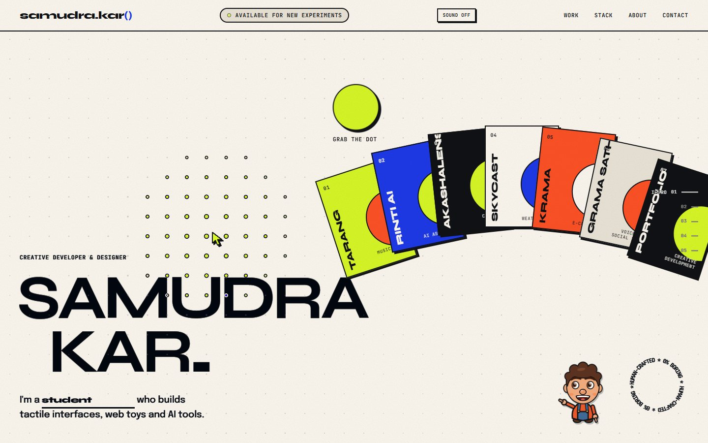

<br />
<br />

# Samudra Kar, portfolio

**A scroll-driven, cursor-aware portfolio where every project is its own small world.**

Seven interactive project scenes · a hidden door · a contact form with a real backend

<br />

[**Live site**](https://sam-sportfolio.vercel.app) &nbsp;·&nbsp; [The tour](#the-tour) &nbsp;·&nbsp; [The seven worlds](#the-seven-worlds) &nbsp;·&nbsp; [How it works](#how-it-works) &nbsp;·&nbsp; [Run it](#run-it-locally) &nbsp;·&nbsp; [Contact API](#contact-api)

<br />


</div>

---

## What this is

A portfolio built to feel like a **tactile object, not a template**. Warm paper, deep ink, and three loud accents (electric lime, cobalt, vermilion). Hard 2px borders, hard offset shadows, slightly crooked layouts.

The idea behind the build: **scrolling is navigation, motion is storytelling, the cursor is a tool, sections are scenes.** Nothing animates just because it can. If you can't say what a movement communicates, it isn't in here.

<div align="center">

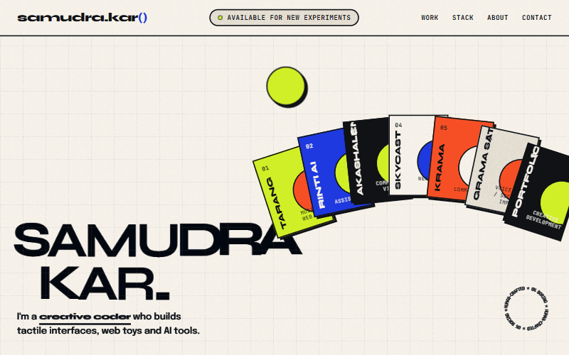

<sub>The signature scroll: the dot drops ink, the ink takes over, and project chapters slide up over each other.</sub>

</div>

## The tour

### 1. Hero: stillness, then a small thing to play with

Paper, a grid, and one lime dot. The type inflates in letter by letter (Syne's variable weight axis), then thickens and lifts under your cursor. Grab the dot and throw it. Seven project cards are dealt out like a hand; hover one to lift it, click to jump to that world.

Scroll and the stage pins. **The dot drops ink from wherever you left it.** The ink fills the screen, the type inverts, and the ink flows straight into the Work section.

<table>
  <tr>
    <td width="50%">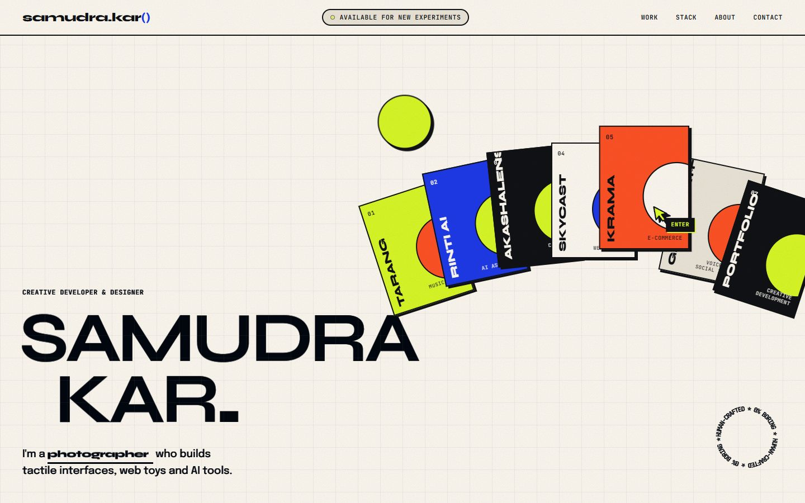<br /><sub>The deck: each card is a link to its chapter.</sub></td>
    <td width="50%">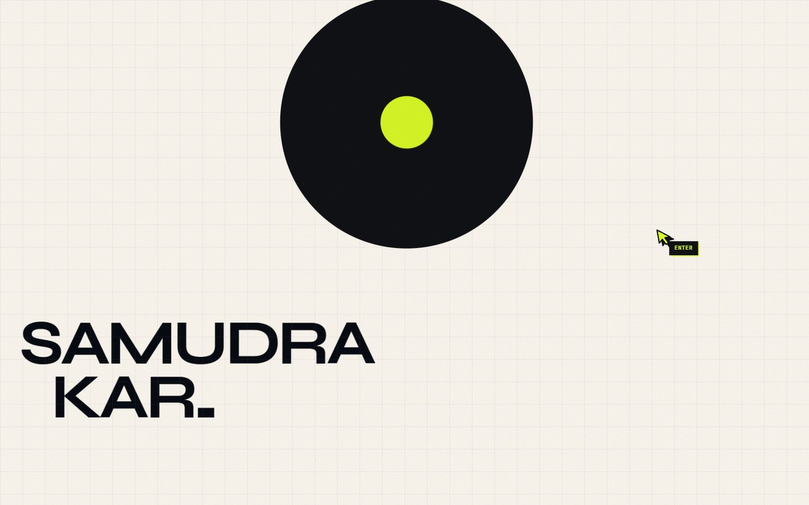<br /><sub>Mid-takeover: the type inverts as the ink crosses it.</sub></td>
  </tr>
</table>

### 2. Work: seven chapters that cover each other

An index of the seven worlds with a live preview card. Then each project is a pinned, full-height stage. The next chapter **slides up over the previous one** while the old one shrinks back, and each scene opens with its own mask (rise, wipe, iris, wipe from the other side). A giant outlined title drifts sideways behind every chapter, so there's horizontal motion inside the vertical scroll.

<table>
  <tr>
    <td width="50%">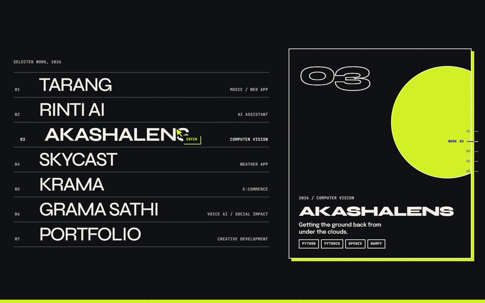</td>
    <td width="50%">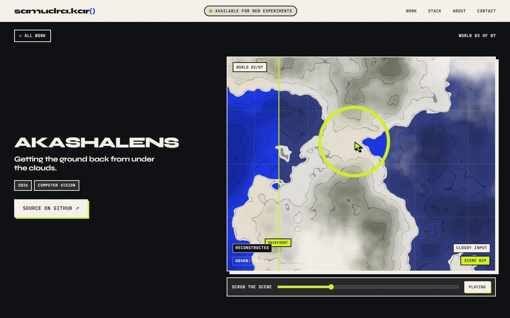</td>
  </tr>
  <tr>
    <td><sub>The index. Hovering fills a row and wakes the preview.</sub></td>
    <td><sub>Case-study page: the same world, large, with a scrub bar you can drive by hand.</sub></td>
  </tr>
</table>

Opening a case study uses a curtain that **grows out of the scene you clicked**, carries the project's name, swaps the route underneath, then wipes away.

### 3. Toolbox: a sticker sheet that can't lie

Every tool in every project's `tech` list becomes a sticker. The more worlds use it, the bigger it prints. It is computed from the project data, so it can only ever show what the work actually used. Stickers are draggable.

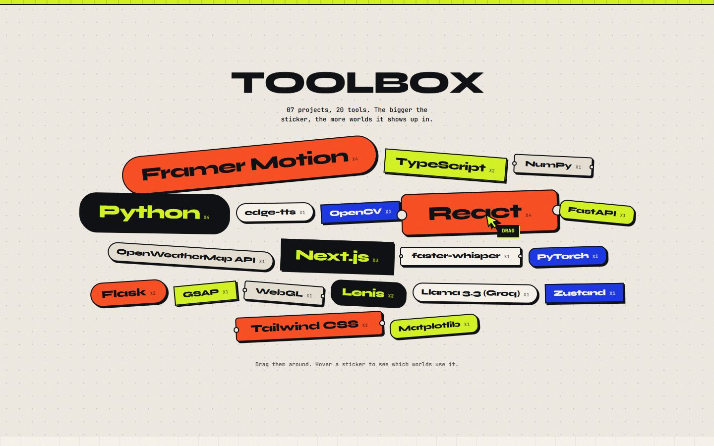

### 4. About: a desk you discover

On desktop the stage pins and objects land on the desk one by one as you scroll: an ID card, index cards for each facet (drag them anywhere), a print, a cassette (Now Playing), a sticky note (Currently Building) and a studio stamp.

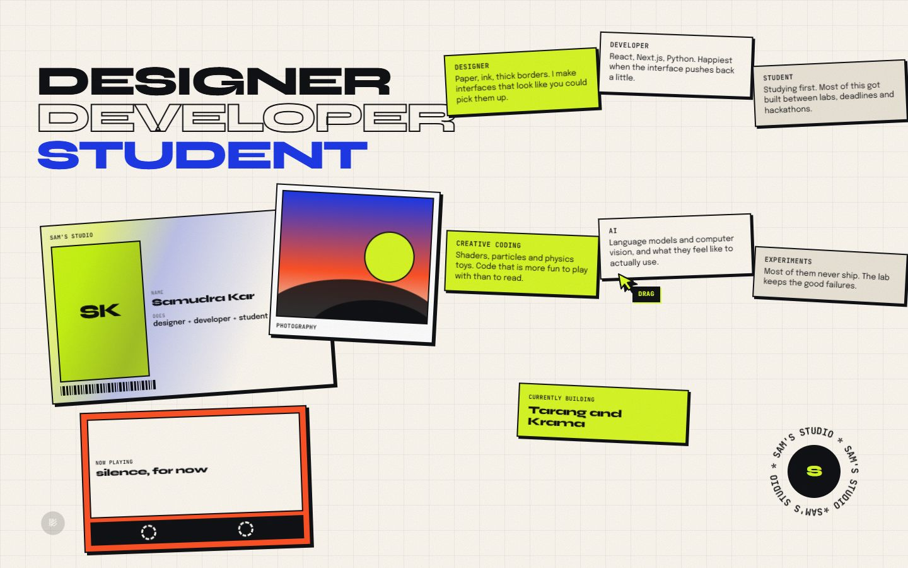

### 5. Contact: the last scene

An ink dome rises over the desk like a tide. A lime sun comes up behind the headline, and **your cursor is a torch**: wherever it points, the type lights up lime. The form posts to the [Contact API](#contact-api).

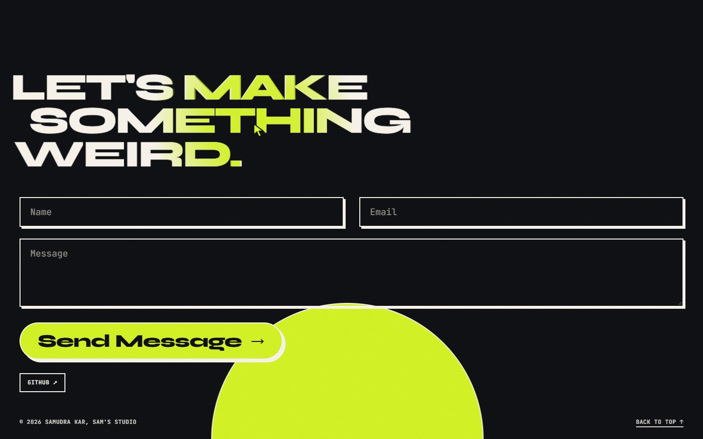

### 6. Kage: one hidden door

Somewhere on the About desk is a faint ink blot. (Or type `kage` anywhere.) Click it: the site drains of colour, ink irises out from the blot, and you're in **Kage**, a full scroll-storytelling scene. Escape or the Back button retraces the path and puts you exactly where you were.

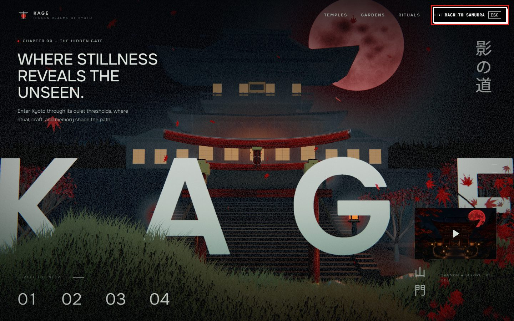

## The seven worlds

Every project is a small interactive scene with **its own motion personality**, driven by scroll, cursor, hover and scroll velocity. All of them run from the same `SceneContext`, so the scene in a chapter and the large one on the case-study page are the same component.

<table>
  <tr>
    <td width="33%">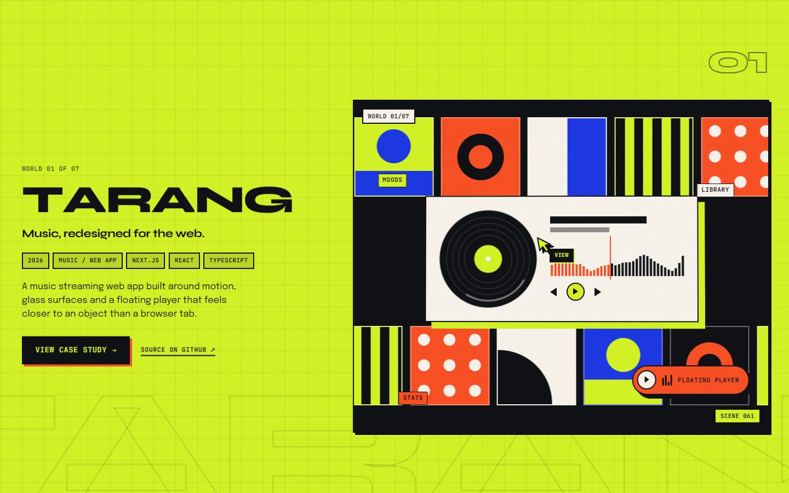</td>
    <td width="33%">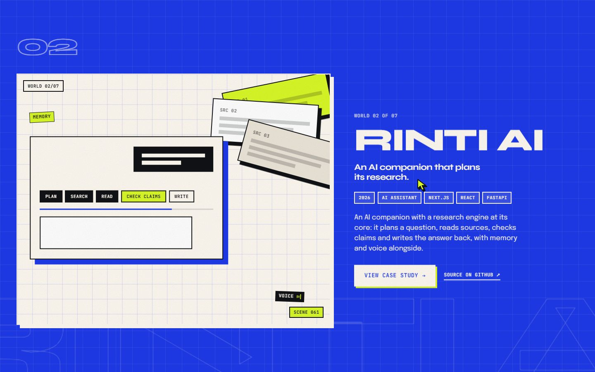</td>
    <td width="33%">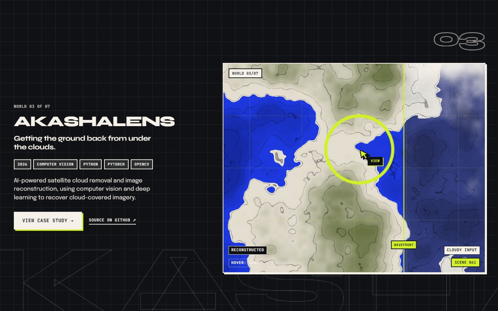</td>
  </tr>
  <tr>
    <td><b>Tarang</b><br /><sub>Rhythm. Album tiles drift sideways at two speeds, the record spins faster the harder you scroll, the waveform swells under the cursor, hovering scrubs the playhead.</sub></td>
    <td><b>Rinti AI</b><br /><sub>Conversation. One exchange plays as you scroll while the research pipeline (plan, search, read, check claims, write) lights up stage by stage.</sub></td>
    <td><b>AkashaLens</b><br /><sub>Reconstruction. A WebGL shader draws one landscape twice, cloudy and clean. A wavefront sweeps across on scroll, and a lens reconstructs under the cursor.</sub></td>
  </tr>
  <tr>
    <td width="33%">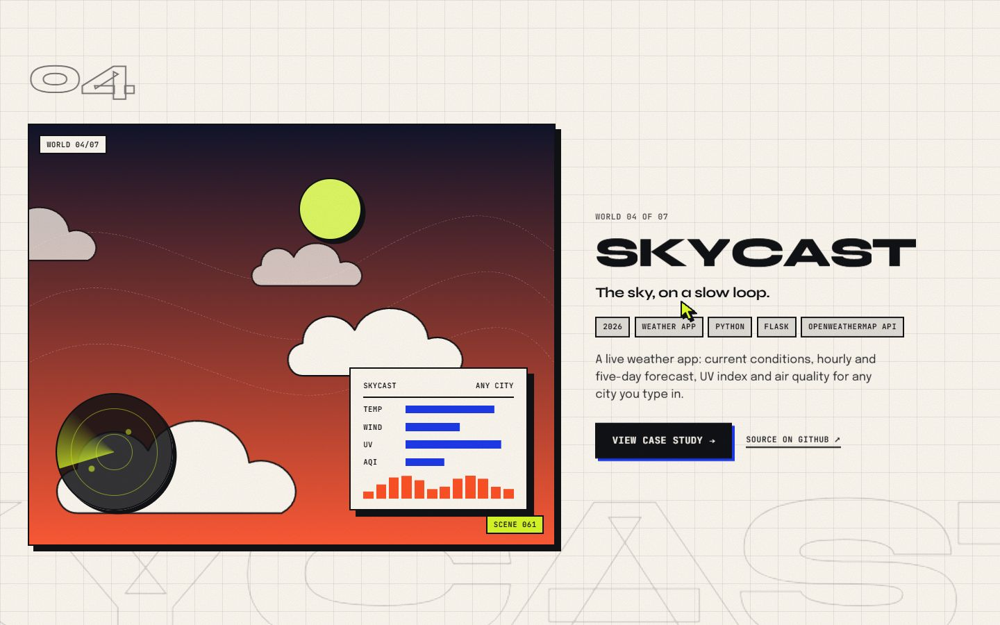</td>
    <td width="33%">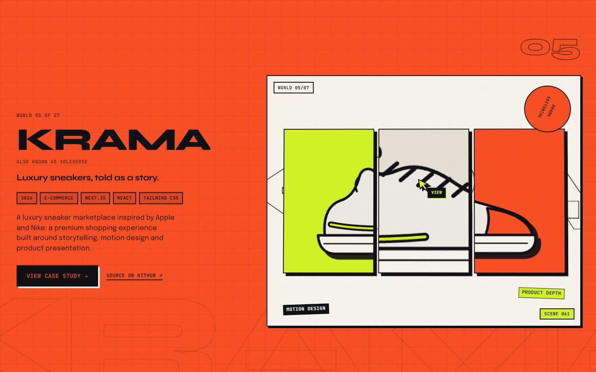</td>
    <td width="33%">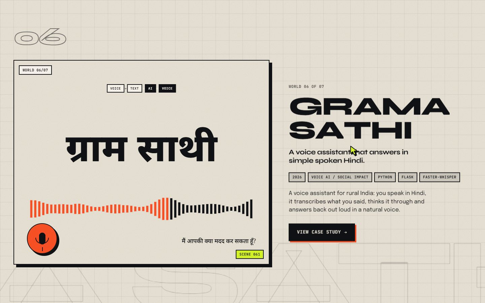</td>
  </tr>
  <tr>
    <td><b>SkyCast</b><br /><sub>Atmosphere. Scroll is time of day: dawn to night through the palette, a sun that becomes a moon, clouds on their own clock, a radar sweep.</sub></td>
    <td><b>Krama</b><br /><sub>Product depth. One sneaker sliced into three crop windows that assemble as you scroll and come apart again. The cursor magnifies a slice and tilts the product.</sub></td>
    <td><b>Grama Sathi</b><br /><sub>Voice. Idle, listening, replying, in Hindi (Devanagari). Scroll plays the loop; press and hold the mic to take over.</sub></td>
  </tr>
  <tr>
    <td colspan="3">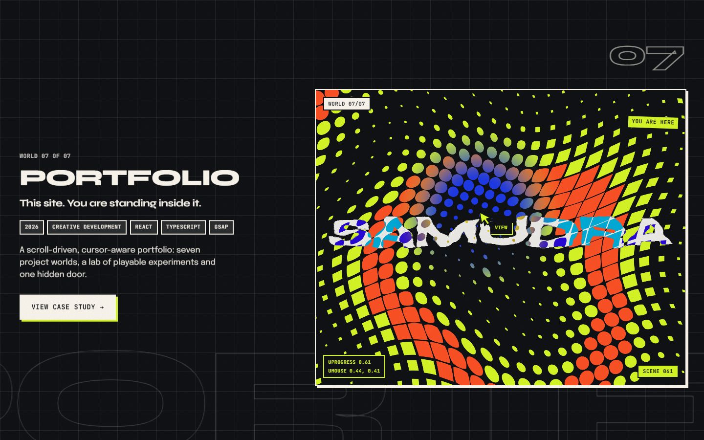<br /><b>Portfolio</b><br /><sub>Shader language. A halftone grid of cells that morph between circle and square, driven by two real uniforms (scroll progress and the pointer) that are printed on the scene. The name is warped by an SVG displacement filter whose strength is hover plus scroll speed.</sub></td>
  </tr>
</table>

| Project | What it is | Source |
| :-- | :-- | :-- |
| **Tarang** | A music streaming web app built around motion, glass surfaces and a floating player | [Samudra-GITHUB/Tarang](https://github.com/Samudra-GITHUB/Tarang) |
| **Rinti AI** | An AI companion with a research engine (planner, extractors, claim checking, synthesis), memory and voice | [Samudra-GITHUB/Rinti-Ai](https://github.com/Samudra-GITHUB/Rinti-Ai) |
| **AkashaLens** | Satellite cloud removal and image reconstruction; built for the ISRO Hackathon 2026 | [Samudra-GITHUB/AkashaLens](https://github.com/Samudra-GITHUB/AkashaLens) |
| **SkyCast** | A live weather app: current conditions, hourly and 5-day forecast, UV index and air quality | [Samudra-GitHub/SkyCast-Weather-App](https://github.com/Samudra-GitHub/SkyCast-Weather-App) |
| **Krama** *(also SoleVerse)* | A luxury sneaker marketplace built around storytelling and motion | [Samudra-GITHUB/Krama](https://github.com/Samudra-GITHUB/Krama) |
| **Grama Sathi** | A Hindi voice assistant: speak, it transcribes, thinks, and answers aloud | n/a |
| **Portfolio** | This site | you're here |

> The scenes are visual interpretations of each project, not screenshots. The AkashaLens shader, for example, is a metaphor for cloud removal, not output from the model.

## On small screens

Mobile isn't a scaled desktop. Below 1000px (or with `prefers-reduced-motion`) the pins and chapter overlaps are dropped: scenes stack, scroll still drives each scene, and the hero deck re-fans across the width of the screen.

<table>
  <tr>
    <td width="25%">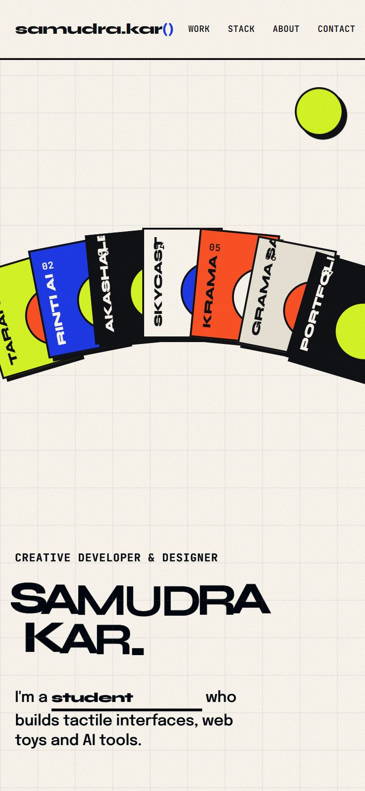</td>
    <td width="25%">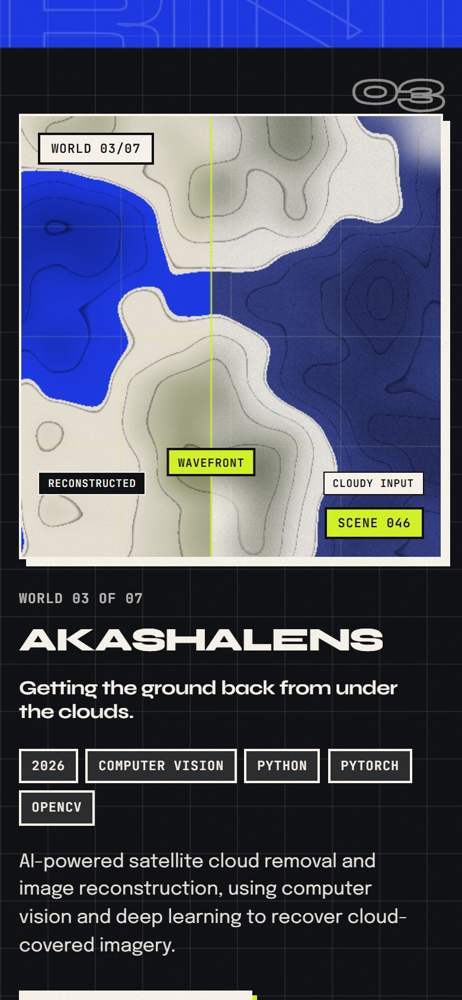</td>
    <td width="25%">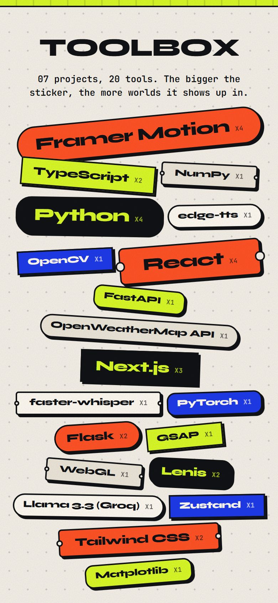</td>
    <td width="25%">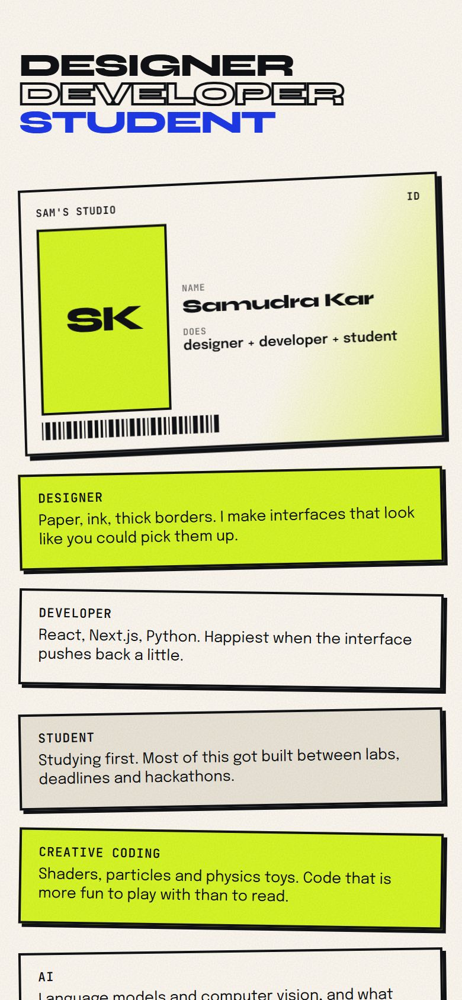</td>
  </tr>
</table>

## How it works

### Motion stack

Motion is split on purpose. **GSAP owns page-level choreography and Framer Motion owns component-level values. They never animate the same element.**

| Job | Tool |
| :-- | :-- |
| Smooth scroll and scroll velocity | **Lenis**, driven by GSAP's ticker |
| Pinned scenes, scrubbed timelines, masks, reveals | **GSAP + ScrollTrigger** |
| Cursor, hover and drag physics, per-scene parallax values | **Framer Motion** motion values |
| Shader worlds (AkashaLens, Portfolio) | **Raw WebGL** (`ShaderCanvas`), no Three.js |
| Every per-frame effect | **One shared `gsap.ticker`**: a single `requestAnimationFrame` for the whole site |

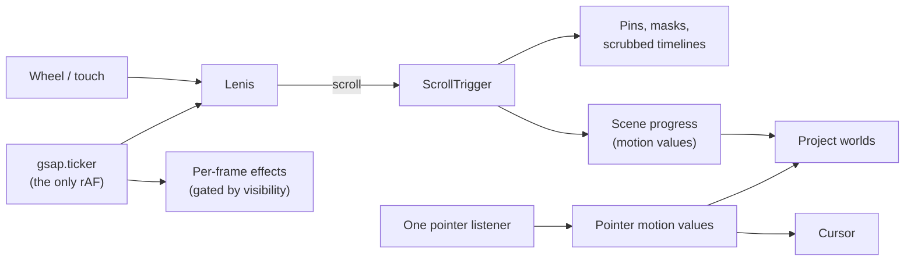
```mermaid
flowchart LR
  Input["Wheel / touch"] --> Lenis
  Ticker["gsap.ticker<br/>(the only rAF)"] --> Lenis
  Lenis -->|scroll| ST["ScrollTrigger"]
  ST --> Choreo["Pins, masks,<br/>scrubbed timelines"]
  ST --> Progress["Scene progress<br/>(motion values)"]
  Pointer["One pointer listener"] --> MV["Pointer motion values"]
  Progress --> Worlds["Project worlds"]
  MV --> Worlds
  MV --> Cursor["Cursor"]
  Ticker --> Frame["Per-frame effects<br/>(gated by visibility)"]
```

### The scroll system (desktop)

- The hero is a sticky 100dvh stage inside a taller section. A scrubbed timeline fades the copy while the ink circle grows from the dot's *current* position.
- Each project chapter is a sticky stage inside a taller box. The **next chapter has a negative top margin**, so it slides up over the pinned one. The covered chapter scales back and is marked `inert` so keyboard focus can't land on something you can't see.
- Each chapter hands its world a `progress` value (0 to 1 across its whole scroll range). Worlds never read scroll or the pointer directly.

### The cursor

One lime arrow that looks like one of the site's buttons: lime fill, 2px ink outline, hard offset shadow, tip exactly on the pointer. It only runs on `(hover: hover) and (pointer: fine)` devices. State comes from attributes on whatever it's over:

```html
<a data-cursor="project" data-cursor-label="ENTER">…</a>
```

| `data-cursor` | Used for |
| :-- | :-- |
| *(default)* | the plain arrow |
| `link` *(any `a` or `button`)* | the arrow tilts and its shadow grows, like a button lifting |
| `project` · `play` · `drag` · `image` · `scroll` · `cta` | a small mono label chip appears beside the arrow |

Pressing nudges the arrow down and right and collapses the shadow, matching `.btn:active`.

### Typography as a material

Syne is a variable font whose width changes a lot with weight (an "S" is about half as wide at 400 as at 800). `ProximityText` gives every letter its own slot sized for the *resting* weight; letters swell past their slot symmetrically under the cursor, so the line never reflows.

### Performance and accessibility

- **Nothing runs offscreen.** Per-frame work is gated by `IntersectionObserver`, tab visibility and whether Kage is open.
- **WebGL is disciplined:** DPR is capped (lower on compact screens), context loss is handled, the context is released on unmount, and a fresh canvas is created per mount.
- **Code splitting:** each world, the case-study page and Kage are separate lazy chunks. The main bundle is about **573 kB (190 kB gzipped)**.
- **Fonts are self-hosted** variable fonts (Fontsource); the Devanagari face loads only when the Grama Sathi world mounts.
- **Reduced motion** disables Lenis, pins, scrubs, animated shaders and the page-transition curtain.
- Semantic landmarks, a skip link, visible `:focus-visible` rings, and keyboard-operable controls where an interaction has a real purpose (the mic, the scene scrub bar, the Kage door, the contact form).

## Run it locally

```bash
git clone https://github.com/Samudra-GITHub/Sam-s_Portfolio.git
cd Sam-s_Portfolio
npm install
npm run dev
```

Open <http://localhost:5173>. The frontend needs no keys.

| Script | What it does |
| :-- | :-- |
| `npm run dev` | Verifies the Kage assets, then starts Vite |
| `npm run build` | Verifies the Kage assets, typechecks (`tsc -b`), builds |
| `npm run preview` | Serves the production build |
| `npm run lint` | `oxlint` |
| `npm run sync:kage` | Copies and hash-verifies the Kage assets (see below) |

### With the contact form

The form posts to a small Express service in [`backend/`](backend). Run it alongside the frontend:

```bash
cd backend
npm install
cp .env.example .env     # then fill in the values below
npm run dev              # http://localhost:3000
```

Point the frontend at it with a root `.env` (defaults to `http://localhost:3000` if unset):

```env
VITE_BACKEND_URL=http://localhost:3000
```

## Contact API

A deliberately small Express + TypeScript service.

| Endpoint | Purpose |
| :-- | :-- |
| `GET /api/health` | Returns `{ "status": "ok" }` |
| `POST /api/contact` | Validates the message and emails it to you through [Resend](https://resend.com) |

`POST /api/contact` takes JSON:

```json
{ "name": "Ada", "email": "ada@example.com", "message": "Hello" }
```

- **Validation** (Zod): `name` 1 to 100 characters, a valid `email`, `message` 1 to 2000 characters. Failures return `400` with `error.code = "VALIDATION_ERROR"`.
- **Rate limit:** 10 requests per 15 minutes per IP on `/api/contact` (`429` with `TOO_MANY_REQUESTS`).
- **Hardening:** `helmet` headers, CORS pinned to `FRONTEND_ORIGIN`, and every user-supplied field HTML-escaped before it goes into the email body.
- Replies set `reply-to` to the sender, so you answer straight from your inbox.

| Variable | Meaning |
| :-- | :-- |
| `PORT` | Port to listen on (default `3000`) |
| `FRONTEND_ORIGIN` | Allowed CORS origin, e.g. your site URL (defaults to `*`, so set it in production) |
| `RESEND_API_KEY` | Your Resend API key |
| `RESEND_FROM` | Sender address (defaults to Resend's `onboarding@resend.dev`) |
| `CONTACT_EMAIL` | The inbox that receives messages |

`npm test` inside `backend/` runs the API tests against a server that is already running on `localhost:3000`.

## Deploy

| Part | Where | Config |
| :-- | :-- | :-- |
| Frontend | **Vercel** (live at <https://sam-sportfolio.vercel.app>) | [`vercel.json`](vercel.json) rewrites every path to `index.html` so deep links like `/work/krama` work |
| Contact API | **Render** (web service) | [`render.yaml`](render.yaml): build `cd backend && npm install && npm run build`, start `cd backend && npm start`; secrets are set in the dashboard, not in the repo |

Set `VITE_BACKEND_URL` in the Vercel project to your deployed API URL.

## Make it yours

All content lives in `src/data/`, and **placeholders are hidden automatically**: any field still holding a `[PLACEHOLDER_…]` string is skipped by the UI (via `real()` in `src/lib/content.ts`), so nothing renders as broken text or a dead link.

| File | What to edit |
| :-- | :-- |
| `config.ts` | Name, studio, roles, About facets, *Currently building*, *Now playing* (set `track` and `artist` and the cassette starts spinning), and contact links (empty ones are hidden) |
| `projects.ts` | The seven projects: copy, tech, highlights, palette, links. The Toolbox is generated from each project's `tech`. Add a `live` URL or a `longDescription` and the case-study page picks it up |

Adding a project world means a new file in `src/components/work/worlds/` and one line in its `index.ts`.

## Kage

The Kage scene is the authored `KageLandingPage` from [`@designcodeio/threeui`](https://threeui.com), used **unmodified**, with the same props. The component loads `/landing-pages/kage.html` from the site root, so [`scripts/sync-kage.mjs`](scripts/sync-kage.mjs) copies those files out of the package into `public/landing-pages/` and **verifies every file's sha256 against [`kage-landing-page.json`](kage-landing-page.json)**. It runs automatically before `dev` and `build` and fails loudly if anything doesn't match.

The scene is a lazy chunk, so visitors who never open it never download it.

## Project structure

```
.
├── backend/                 Express contact API (Resend, Zod, helmet, rate limit)
├── docs/                    README screenshots and the scroll GIF
├── public/                  favicon, plus Kage's assets (synced + verified)
├── scripts/sync-kage.mjs    copy and sha256-verify the Kage assets
├── src/
│   ├── lib/                 runtime (media queries, pause), pointer, scroll, ticker hooks, gsap setup
│   ├── data/                config.ts, projects.ts   ← content lives here
│   ├── components/
│   │   ├── core/            SmoothScroll, Cursor, Magnetic, PageTransition, ProximityText, Split, ShaderCanvas
│   │   ├── hero/            the dot, the deck, the ink takeover
│   │   ├── work/            index, chapters, SceneFrame, worlds/ (one file per project)
│   │   ├── stack/           the Toolbox
│   │   ├── about/           the desk
│   │   ├── contact/         the final scene and the form
│   │   └── kage/            the hidden door (lazy) and its trigger
│   ├── pages/               Home, ProjectDetail, NotFound
│   └── styles/              design tokens and base styles
├── render.yaml · vercel.json
└── kage-landing-page.json   the authored Kage manifest used for verification
```

## Design system

| Token | Value | Role |
| :-- | :-- | :-- |
| Paper | `#fdf9f1` | main canvas |
| Sand | `#ebe5d8` | secondary surfaces |
| Ink | `#111215` | text, borders, hard shadows |
| Electric lime | `#d8f827` | primary accent, CTAs, the cursor |
| Cobalt | `#1e3ae8` | secondary accent (white text on it) |
| Vermilion | `#ff5226` | tertiary accent |

**Type:** [Syne](https://fonts.google.com/specimen/Syne) for display, [Epilogue](https://fonts.google.com/specimen/Epilogue) for body, [JetBrains Mono](https://www.jetbrains.com/lp/mono/) for labels, and Noto Sans Devanagari for the Grama Sathi scene.

**Rules:** 2px borders, hard offset shadows (never blurred), asymmetry on purpose, lime stays under ink text and cobalt stays under white. The system evolves, but it should always read as the same person with better craft.

## Known limitations

- The sneaker in the Krama world is hand-drawn SVG; real photography or renders would beat it.
- The About ID card uses an "SK" monogram because there's no portrait.
- Frame rates haven't been profiled on real GPUs or a range of phones, and the touch experience has had less testing than the mouse one.
- The main JS bundle is large for a portfolio (573 kB, 190 kB gzipped) because it carries React, Router, GSAP, Framer Motion and Lenis. Worlds, case studies and Kage are split out.

## Credits and licenses

- Fonts are served through [Fontsource](https://fontsource.org) (SIL Open Font License).
- Kage comes from [ThreeUI](https://threeui.com) (`@designcodeio/threeui`, MIT, including its bundled Three.js runtime and fonts; see the package's `ASSET-LICENSES.md`).
- [GSAP](https://gsap.com/standard-license) is used under its standard no-charge license. [Lenis](https://lenis.darkroom.engineering) and [Framer Motion](https://www.framer.com/motion/) are MIT.
- No license has been chosen for this repository's own code yet, so until one is added, all rights are reserved by the author.

---

<div align="center">

**Human-crafted · 0% boring**

Designed and built by [Samudra Kar](https://github.com/Samudra-GITHUB) · Sam's Studio

</div>
